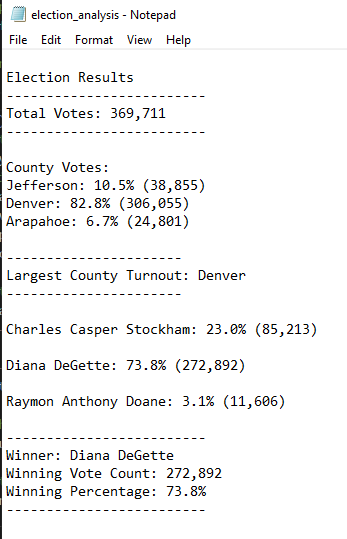

# Election_Analysis

## Project Overview
A Colorado Board of Elections employee has given you the following tasks to complete the election audit of a recent local congressional election

1. Calculate the total number of votes cast.
2. Get a complete list of candidates who received votes.
3. Calculate the total number of votes each candidate received.
4. Calculate the percentage of votes each candidate won.
5. Determine the winner of the election based on popular vote.

## Resources
- Data Source: election_results.csv
- Software: Python 3.6.1, Visual Studio Code, 1.38.1

## Summary
The analysis of the election show that:
- There were 369,711 votes cast in the election.
- The candidates were:
  - Charles Casper Stockham
  - Diana DeGette
  - Raymon Anthony Doane
- The candidate results were:
  - Charles Casper Stockham received 23.0% of the vote and 85,213 number of votes.
  - Diana DeGette received 73.8% of the vote and 272,892 number of votes.
  - Raymon Anthony Doane received 3.1% of the vote and 11,606 number of votes.
- The winner of the election was:
  - Diana DeGette, who received 73.8% of the vote and 272,892 number of votes.

## Challenge Overview
The same Colorado Board of Elections employee would like additional tasks completed in the election audit related to county data of the voters.

1. Calculate the total votes cast in this congressional election.
2. Provide a breakdown of the number of votes and the percentage of total votes for each county in the precinct.
3. Determine which county had the largest number of votes
4. Provide a breakdown of the number of votes and the percentage of the total votes each candidate received.
5. Determine which candidate won the election, their vote count, and their percentage of the total votes

## Challenge Summary
Additional analysis of the election show that
- There were 369,711 votes cast in the election.
- The county results were:
  - Jefferson county cast 10.5% of the vote and 38,855 number of votes.
  - Denver county cast 82.8% of the vote and 306,055 number of votes.
  - Arapahoe county cast 6.7% of the vote and 24,801 number of votes.
- Denver county had the largest number of votes.
- The candidate results were:
  - Charles Casper Stockham received 23.0% of the vote and 85,213 number of votes.
  - Diana DeGette received 73.8% of the vote and 272,892 number of votes.
  - Raymon Anthony Doane received 3.1% of the vote and 11,606 number of votes.
- The winner of the election was:
  - Diana DeGette, who received 73.8% of the vote and 272,892 number of votes.

See the text file printed below:

## Election-Audit Summary
As long as the CSV file maintains the same formatting, this script can be used for any election with just a couple of modifications.

1. The file names would require modification accordingly.
2. If using this script for a larger scale election, such as national, then we may want to add script calculating votes by states. This would also require adding a new column to the CSV file.
3. Script could also be modified for columns added with exactly city names, districts, gender of voters, age of voters, and political party affiliation of voters.
